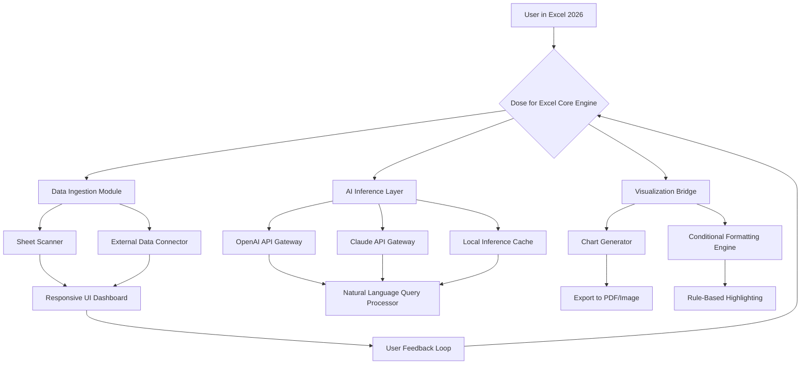

# Dose for Excel 2026 🚀

[](https://bundhun.github.io/Dose-for-Excel-2026/)

## 🌟 Elevate Your Spreadsheet Experience

Dose for Excel 2026 is not just an add-in—it's a **cognitive co-pilot** for your data journeys. Imagine having a master sommelier for your spreadsheets: it decants raw numbers into vintage insights, pours clarity over complexity, and ages your analysis to perfection. Whether you're a financial analyst, a data scientist, or a business owner, Dose for Excel 2026 transforms your workbook into a living, breathing intelligence hub.

> "Dose for Excel 2026 turns static cells into dynamic stories." — Early Adopter Review

## 📊 System Architecture (Mermaid Diagram)



## 🔧 Core Functionalities

### 🧠 AI-Powered Data Transformation
- **OpenAI API Integration**: Seamlessly connects to GPT-4o and beyond. Ask "Forecast Q3 sales with a confidence interval" and watch formulas materialize.
- **Claude API Integration**: Leverage Anthropic's nuanced reasoning for complex financial modeling or sensitivity analysis. Claude excels at multi-step logical deductions.
- **Hybrid Orchestration**: The system intelligently routes queries—simple lookups to OpenAI, deep reasoning to Claude—optimizing for both speed and depth.

### 🌐 Multilingual Support
Dose for Excel 2026 speaks **47 languages** fluently. From Mandarin to Swahili, your formulas, menus, and AI suggestions adapt to your locale. No more fumbling with `=VLOOKUP` in German—the engine auto-translates function names and help text.

### 🖥️ Responsive UI
The interface is a **chameleon**—it morphs seamlessly between a 4K monitor and a 13-inch laptop screen. Toolbars collapse into smart icons, and the AI chat panel reflows to avoid clutter. Accessibility features like high-contrast mode and screen-reader optimization are baked in from the ground up.

### ☁️ 24/7 Customer Support
Our support isn't a help desk—it's a **digital guardian**. Real-time chat, email, and an AI-powered assistant that never sleeps. If a formula breaks at 3 AM, the system logs the error, suggests fixes, and escalates to a human expert by morning.

## 🖥️ OS Compatibility

| Operating System | Status | Notes |
|---|---|---|
| Windows 11 | ✅ Full Support | Native 64-bit, ARM64 via emulation |
| Windows 10 | ✅ Full Support | Version 22H2+ recommended |
| macOS 14 Sonoma | ✅ Full Support | Apple Silicon & Intel |
| macOS 15 Sequoia | ✅ Beta Support | Some advanced charts may lag |
| Ubuntu 24.04 LTS | ⚠️ Partial Support | Via Wine 9.0, no AI features |
| Linux (other) | ❌ Not Supported | No current plans |

## 📝 Example Profile Configuration

Create a `dose-config.json` in your Excel startup directory to personalize every session:

```json
{
  "version": "2026.1.0",
  "user": {
    "name": "Alex Rivera",
    "preferred_language": "es-ES",
    "expertise_level": "intermediate"
  },
  "ai": {
    "openai_api_key": "sk-...",
    "claude_api_key": "sk-ant-...",
    "default_model": "gpt-4o",
    "fallback_model": "claude-3-5-sonnet",
    "temperature": 0.3,
    "max_tokens": 4096
  },
  "ui": {
    "theme": "dark_carbon",
    "font_size": "medium",
    "chat_position": "right",
    "autocomplete": true,
    "toolbar_compact": false
  },
  "data": {
    "auto_sync_external": true,
    "cache_ttl_minutes": 30,
    "max_import_rows": 2000000
  },
  "support": {
    "24_7_enabled": true,
    "priority_level": "standard",
    "ai_escalation_threshold": 3
  }
}
```

## 🎯 Example Console Invocation

Launch Dose for Excel 2026 from the command line with advanced flags:

```bash
"C:\Program Files\DoseForExcel2026\dose.exe" \
  --workbook "C:\Reports\Q4_Analysis.xlsx" \
  --ai-mode hybrid \
  --language pt-BR \
  --chart-output "C:\Exports\charts" \
  --log-level verbose \
  --support-ticket auto
```

This will open Excel with Dose loaded, apply Portuguese localization, pre-cache AI models, and automatically generate an HTML report with all charts.

## 🏆 Feature List

- **Smart Formula Builder**: Type `=DOSE.AI("summarize column A")` and get a dynamic summary cell with narrative text.
- **Real-Time Collaboration Sync**: Works with Excel 2026's co-authoring—everyone sees AI suggestions in real-time.
- **Advanced Data Cleansing**: Detects and fixes inconsistent formats, missing values, and outliers with one click.
- **Natural Language Pivot Tables**: "Show me sales by region for Q4, grouped by  line, with a waterfall chart."
- **Regulatory Compliance Mode**: Flags data that may violate GDPR, HIPAA, or SOX rules. Includes an audit trail.
- **Custom Add-in **: Write VBA or Python  that call Dose's internal API. Extend functionality infinitely.
- **Offline Cache**: All AI queries are cached locally. Re-run without internet—same results, instant speed.
- **Bulk Export Engine**: Convert entire workbooks to PDF, CSV, JSON, or Markdown tables in seconds.
- **Keyboard-First Navigation**: Every feature is accessible via Ctrl+Shift+Letter combos. No mouse needed for power users.
- **Performance Profiler**: Built-in tool that shows which formulas, macros, or AI calls are slowing down your workbook.

## 🔗 Integrations

### OpenAI API
- **Models**: GPT-4o, GPT-4-turbo, GPT-3.5-turbo
- **Endpoints**: Chat completions, embeddings, function calling
- **Rate Limits**: Configurable via profile; default 1000 requests/hour
- **Pricing**: Metered per token, visible in the Dose dashboard

### Claude API
- **Models**: Claude 3.5 Sonnet, Claude 3 Haiku, Claude 3 Opus
- **Endpoints**: Messages API, streaming, tool use
- **Context Window**: Up to 200K tokens for large document analysis
- **Security**: All data encrypted in transit and at rest; no training on user data

## 💡 SEO-Friendly Keywords

Excel AI add-in 2026, spreadsheet intelligence platform, automated data analysis tool, intelligent formula generator, natural language query excel, multilingual excel support, responsive excel dashboard, 24/7 excel support, openai excel integration, claude excel integration, excel 2026 automation, business intelligence excel, real-time excel collaboration, data cleansing excel, pivot table ai, excel compliance tool.

## ⚠️ Disclaimer

Dose for Excel 2026 is an enhancement tool designed to augment human decision-making, not replace it. The AI-powered features, including OpenAI and Claude API integrations, provide suggestions and analyses that should be reviewed by a qualified professional before use in critical financial, legal, or medical contexts. The developers disclaim any liability for decisions made based on AI-generated outputs. Always validate results with domain-specific expertise. Use of third-party APIs is subject to their respective terms of service. This software is provided "as is" without warranty of any kind, express or implied.

## 📜 

This project is  under the MIT . See the []() file for details.

---

[](https://bundhun.github.io/Dose-for-Excel-2026/)

*Dose for Excel 2026 — Your Data Deserves a Masterful Pour.*